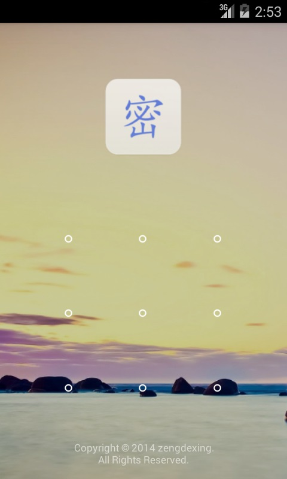
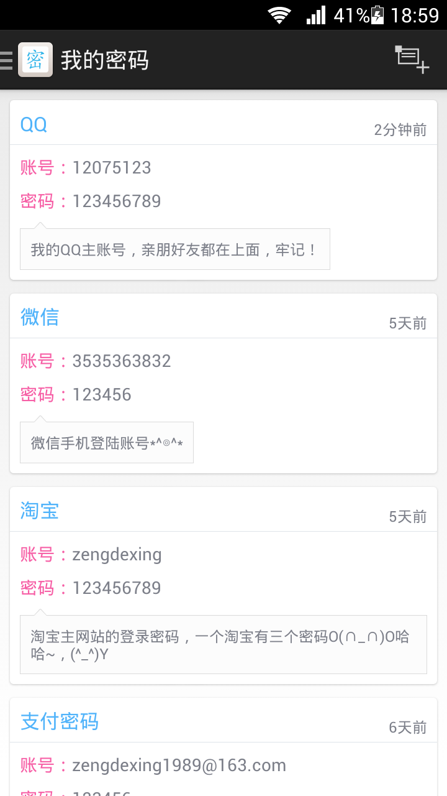
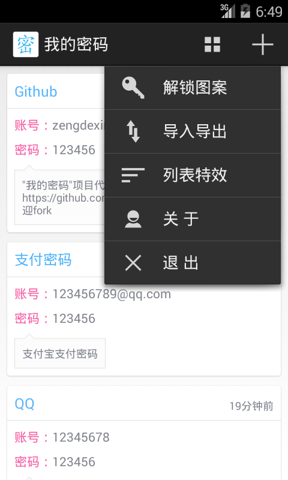
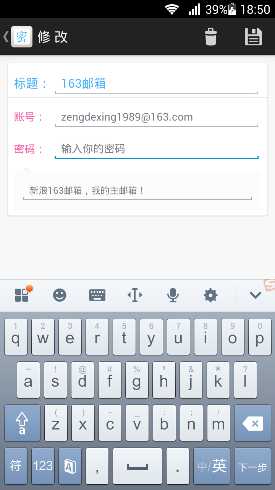
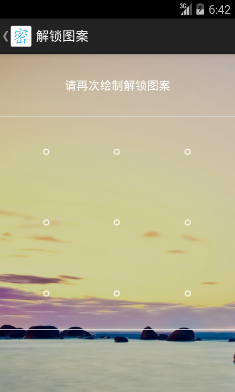

#我的密码

* E-mail：zengdexing1989@163.com
* File encoding：GBK

##简介：
我的密码是一款密码管理软件，用于保存生活中的各种账号和密码。  
安全、简洁、放心、无广告。  
QQ账号？微信号？邮箱密码？网站通行证？通通交给我来保管吧。 

##版本
###2.0.0
- 增加置顶功能

###1.4.0 <a href="apk/">下载</a>
- 增加图案解锁
- 提升程序稳定性
- 优化显示效果

##软件截图

